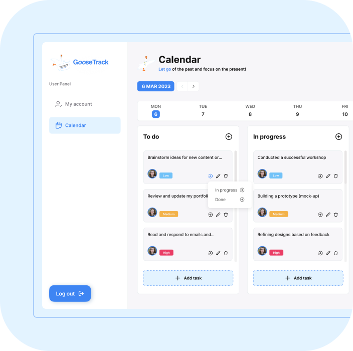

# GooseTrack

Want to store all your tasks in one place? Then **GooseTrack** is right for you!
This application provides you with easy to use task management system, to organize your life and work, all in one place!

## Calendar view

GooseTrack's Calendar view provides a comprehensive overview of your schedule, displaying all your tasks, events, and appointments in a visually appealing and intuitive layout.

## Sidebar

GooseTrack offers easy access to your account settings, calendar, and filters. The 'My Account' section allows you to manage your profile information and preferences, while the calendar provides a quick and convenient way to view your upcoming events and tasks.

## All in one

GooseTrack is an all-in-one productivity tool that helps you stay on top of your tasks, events, and deadlines. Say goodbye to scattered to-do lists and hello to streamlined productivity with GooseTrack.

## Team Starship 🚀

<ul>
  <li style="margin-bottom:6px;"><strong>Front-end Team Lead</strong> - <a href="https://github.com/SalOne22"> Vladyslav Vladinov</a></li>
  <li style="margin-bottom:6px;"><strong>Scrum Master</strong> - <a href="https://github.com/AlexDubin"> Alex Dubin</a></li>
  <li style="margin-bottom:6px;"><strong>Reviews Section</strong> - <a href="https://github.com/zim89"> Alexandr Zim</a></li>
  <li style="margin-bottom:6px;"><strong>Login/Registration</strong> - <a href="https://github.com/TetianaOgni"> Tetiana Ogni</a></li>
  <li style="margin-bottom:6px;"><strong>Account Page</strong> - <a href="https://github.com/KalchenkoNatalya"> Natalya Kalchenko</a></li>
  <li style="margin-bottom:6px;"><strong>Statistics Page</strong> - <a href="https://github.com/em0nti"> Andrii Triukhan</a></li>
  <li style="margin-bottom:6px;"><strong>Chosen Month Page</strong> - <a href="https://github.com/GoodPointt"> Dmytro Petyshyn</a></li>
  <li style="margin-bottom:6px;"><strong>Tasks Redux integration</strong> - <a href="https://github.com/LosOleksandr"> Oleksandr Los</a></li>
  <li style="margin-bottom:6px;"><strong>Calendar Page</strong> - <a href="https://github.com/vadimfront"> Vadim Kofman</a></li>
  <li style="margin-bottom:6px;"><strong>Tasks Card / Modal</strong> - <a href="https://github.com/Elvira9797"> Elvira Lemak</a></li>
  <li><strong>Calendar Toolbar</strong> - <a href="https://github.com/NikKms"> Nikolay Kamyshnikov</a></li>
</ul>
